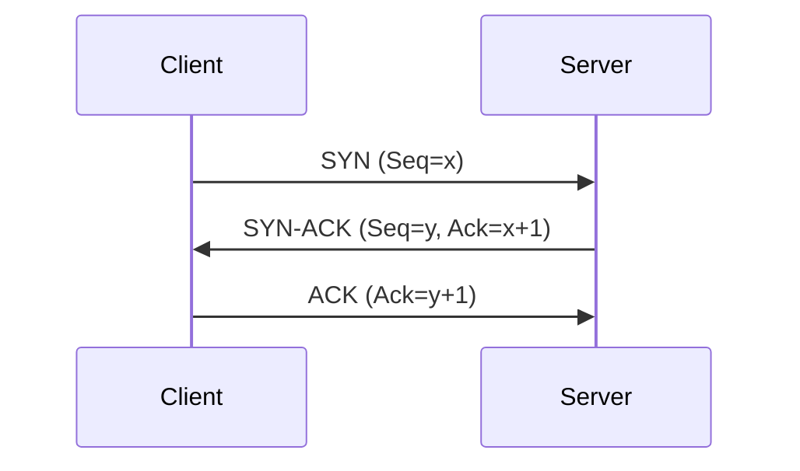
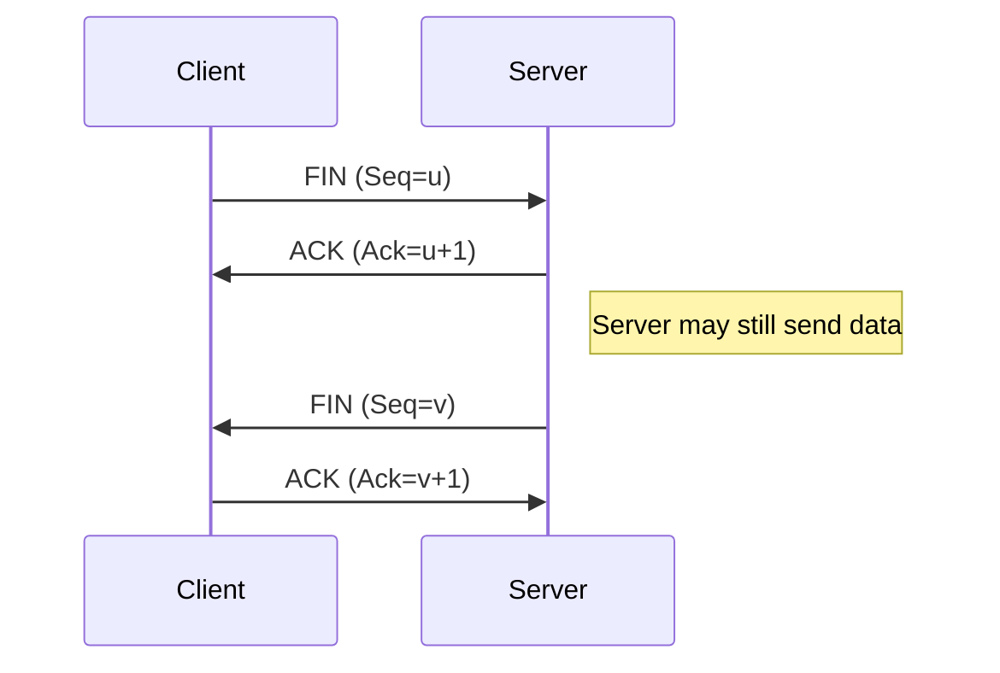

import { Tabs, Callout, Steps } from 'nextra/components'

# Introduction to HTTP and Related Protocols

The **Hypertext Transfer Protocol (HTTP)** is the foundation of data communication on the World Wide Web. Understanding HTTP and related protocols like **HTTPS**, **UDP**, and **RDP** is crucial for developers to build efficient and secure web applications.

<Callout type="info" emoji="🌐">
  **What is HTTP?**  
  HTTP is an application-layer protocol used for transmitting hypermedia documents, such as HTML. It is the protocol underlying any data exchange on the Web.
</Callout>

---

# Why Learn About HTTP and Related Protocols?

- **Web Communication**: HTTP is essential for client-server communication on the web.
- **Security**: Understanding HTTPS helps in securing data transmission.
- **Network Programming**: Knowledge of UDP and TCP is vital for low-level network programming.
- **Remote Access**: Understanding RDP enables the development of remote desktop applications.

---

# The OSI Model and Protocols

Before diving into HTTP and other protocols, it's important to understand where they fit in the **OSI Model**.

<Callout type="info" emoji="📊">
  **OSI Model Layers**:  
  1. Physical  
  2. Data Link  
  3. Network  
  4. Transport  
  5. Session  
  6. Presentation  
  7. Application
</Callout>

---

# Understanding HTTP

## What is HTTP?

HTTP is an application-layer protocol that enables communication between clients (usually web browsers) and servers.

### How HTTP Works

<Steps>

### 1. Client Sends Request

- The client sends an HTTP request to the server.
- Request includes method (e.g., GET, POST), URL, headers, and body.

### 2. Server Processes Request

- The server receives and processes the request.
- It performs necessary actions like querying databases or accessing files.

### 3. Server Sends Response

- The server sends back an HTTP response.
- Response includes status code, headers, and body (usually HTML, JSON, etc.).

</Steps>

### HTTP Methods

- **GET**: Retrieve data from the server.
- **POST**: Send data to the server.
- **PUT**: Update existing data.
- **DELETE**: Delete data on the server.
- **HEAD**: Same as GET but without the response body.

---

# HTTP vs. HTTPS

## What is HTTPS?

**HTTPS** (HTTP Secure) is an extension of HTTP that adds a layer of security using **SSL/TLS** encryption.

### Benefits of HTTPS

- **Encryption**: Protects data in transit from eavesdroppers.
- **Authentication**: Verifies the identity of the server.
- **Integrity**: Ensures data hasn't been tampered with.

<Callout type="info" emoji="🔒">
  **SSL/TLS**: Secure Sockets Layer (SSL) and Transport Layer Security (TLS) are cryptographic protocols providing communication security over a computer network.
</Callout>

### How HTTPS Works

<Steps>

### 1. SSL/TLS Handshake

- Client and server establish a secure connection.
- They agree on encryption algorithms and exchange keys.

### 2. Encrypted Communication

- All HTTP requests and responses are encrypted.
- Data cannot be read or altered by third parties.

</Steps>

---

# Understanding TCP and UDP

## TCP (Transmission Control Protocol)

TCP is a transport-layer protocol that provides reliable, ordered, and error-checked delivery of data between applications.

### Features

- **Connection-oriented**: Establishes a connection before data transfer.
- **Reliable**: Guarantees delivery of packets in order.
- **Error Checking**: Uses checksums for error detection.

### TCP Connection Process

#### Three-Way Handshake (Connection Establishment)

TCP uses a **three-way handshake** to establish a connection between the client and server.

<Steps>

### 1. SYN (Synchronize)

- **Client ➡️ Server**: The client sends a **SYN** packet to the server to initiate a connection.
- Indicates the client's initial sequence number (ISN).

### 2. SYN-ACK (Synchronize-Acknowledge)

- **Server ➡️ Client**: The server responds with a **SYN-ACK** packet.
- Acknowledges the client's SYN and provides the server's own ISN.

### 3. ACK (Acknowledge)

- **Client ➡️ Server**: The client sends an **ACK** packet back to the server.
- Acknowledges the server's SYN-ACK.
- Connection is now established, and data transfer can begin.

</Steps>

**Mermaid Diagram of TCP Three-Way Handshake:**



#### Four-Way Handshake (Connection Termination)

When terminating a TCP connection, a **four-step process** is used, known as the **four-way handshake**.

<Steps>

### 1. FIN from Client

- **Client ➡️ Server**: The client sends a **FIN** (Finish) packet to the server.
- Indicates that the client has finished sending data and wants to close the connection from its side.

### 2. ACK from Server

- **Server ➡️ Client**: The server acknowledges the client's FIN by sending an **ACK** packet.
- The server may still send data to the client.

### 3. FIN from Server

- **Server ➡️ Client**: When the server has finished sending data, it sends its own **FIN** packet.
- Indicates that the server also wants to close the connection.

### 4. ACK from Client

- **Client ➡️ Server**: The client acknowledges the server's FIN by sending an **ACK** packet.
- Connection is fully closed after this step.

</Steps>

**Mermaid Diagram of TCP Four-Way Handshake:**



<Callout type="info" emoji="🔄">
  **TCP Connection Lifecycle**  
  Understanding the **three-way handshake** for connection establishment and the **four-way handshake** for connection termination is crucial for network programming and troubleshooting.
</Callout>

<Callout type="warning" emoji="⚠️">
  **TIME_WAIT State**  
  After the connection is closed, the client enters a **TIME_WAIT** state for a certain period to ensure all packets have been received and to prevent delayed packets from interfering with future connections.
</Callout>

---

## UDP (User Datagram Protocol)

UDP is a simpler, connectionless transport-layer protocol.

### Features

- **Connectionless**: No need to establish a connection before data transfer.
- **Unreliable**: No guarantee of packet delivery or order.
- **Low Overhead**: Faster due to minimal protocol mechanisms.

<Callout type="warning" emoji="⚠️">
  **Note:** Use UDP for applications where speed is critical and occasional data loss is acceptable (e.g., video streaming, online gaming).
</Callout>

---

# HTTP over TCP

HTTP uses TCP as its transport protocol.

## Why HTTP Uses TCP

- **Reliability**: Ensures that all HTTP requests and responses are delivered.
- **Order**: Maintains the sequence of messages.
- **Error Handling**: Detects and retransmits lost packets.

---

# Remote Desktop Protocol (RDP)

## What is RDP?

**RDP** is a proprietary protocol developed by Microsoft for remote access to another computer over a network.

### Features

- **Remote Access**: Control a remote computer as if you were physically present.
- **Encryption**: Secures data transmission between client and server.
- **Multiple Channels**: Supports separate virtual channels for different data types.

## How RDP Works

<Steps>

### 1. Client Requests Connection

- User initiates a connection to a remote computer using an RDP client.

### 2. Authentication

- Credentials are sent to the server for authentication.

### 3. Session Establishment

- Upon successful authentication, a session is established.

### 4. Data Exchange

- Keyboard and mouse inputs are sent to the server.
- Display and audio outputs are sent back to the client.

</Steps>

<Callout type="info" emoji="💻">
  **Use Cases**: Remote troubleshooting, accessing files on a remote computer, or running applications remotely.
</Callout>

---

# Protocol Comparison

## Overview

| Protocol | OSI Layer     | Connection Type | Use Cases                          |
|----------|---------------|-----------------|------------------------------------|
| HTTP     | Application   | Connection-oriented (TCP) | Web browsing, APIs               |
| HTTPS    | Application   | Secure TCP      | Secure web browsing, secure APIs   |
| TCP      | Transport     | Connection-oriented | Reliable data transfer          |
| UDP      | Transport     | Connectionless   | Streaming, online gaming           |
| RDP      | Application   | Uses TCP and UDP | Remote desktop access              |

---

# Implementing HTTP Requests

## Using Fetch API (JavaScript)

```javascript
fetch('https://api.example.com/data')
  .then(response => response.json())
  .then(data => console.log(data))
  .catch(error => console.error('Error:', error));
```

## Using cURL (Command Line)

```sh
# HTTP GET request
curl http://www.example.com

# HTTPS GET request
curl https://www.example.com
```

---

# Setting Up a Basic HTTP Server

<Callout type="info" emoji="🛠️">
  **Example**: Creating a simple HTTP server using Node.js.
</Callout>

### Installation

```sh
npm install http
```

### Code Example

```javascript
const http = require('http');

const server = http.createServer((req, res) => {
  res.statusCode = 200;
  res.setHeader('Content-Type', 'text/plain');
  res.end('Hello, World!\n');
});

server.listen(3000, () => {
  console.log('Server running at http://localhost:3000/');
});
```

---

# Securing Your HTTP Server with HTTPS

## Generating SSL Certificates

For local development, you can create self-signed certificates.

```sh
openssl req -nodes -new -x509 -keyout server.key -out server.cert
```

## Setting Up HTTPS Server (Node.js)

```javascript
const https = require('https');
const fs = require('fs');

const options = {
  key: fs.readFileSync('server.key'),
  cert: fs.readFileSync('server.cert')
};

const server = https.createServer(options, (req, res) => {
  res.writeHead(200);
  res.end('Secure Hello, World!\n');
});

server.listen(3000, () => {
  console.log('HTTPS Server running at https://localhost:3000/');
});
```

<Callout type="warning" emoji="⚠️">
  **Note:** In production, obtain SSL certificates from a trusted Certificate Authority (CA).
</Callout>

---

# UDP Communication Example

## Creating a UDP Client and Server (Node.js)

### UDP Server

```javascript
const dgram = require('dgram');
const server = dgram.createSocket('udp4');

server.on('message', (msg, rinfo) => {
  console.log(`Server received: ${msg} from ${rinfo.address}:${rinfo.port}`);
});

server.bind(41234, () => {
  console.log('UDP Server listening on port 41234');
});
```

### UDP Client

```javascript
const dgram = require('dgram');
const message = Buffer.from('Hello UDP Server');
const client = dgram.createSocket('udp4');

client.send(message, 41234, 'localhost', err => {
  client.close();
});
```

---

# HTTP/2 and Beyond

## What is HTTP/2?

HTTP/2 is a major revision of the HTTP protocol that provides performance improvements.

### Features

- **Binary Protocol**: Uses binary framing layer.
- **Multiplexing**: Multiple requests over a single connection.
- **Header Compression**: Reduces overhead.
- **Server Push**: Server can send resources without client request.

## HTTP/3 and QUIC

HTTP/3 is the upcoming version of HTTP that uses **QUIC** (Quick UDP Internet Connections) as its transport protocol.

### Benefits

- **Reduced Latency**: Faster connection establishment.
- **Improved Performance**: Combines benefits of TCP and UDP.
- **Resilience**: Better handling of packet loss.

<Callout type="info" emoji="🚀">
  **Did You Know?**  
  QUIC is built on top of UDP but provides features like connection orientation and reliability.
</Callout>

---

# Troubleshooting Common Issues

## HTTP Errors

- **400 Bad Request**: The server could not understand the request.
- **401 Unauthorized**: Authentication is required.
- **403 Forbidden**: Server refuses to fulfill the request.
- **404 Not Found**: The requested resource could not be found.
- **500 Internal Server Error**: The server encountered an unexpected condition.

## Tips for Debugging

- **Check URLs**: Ensure the request URL is correct.
- **Inspect Headers**: Verify that all required headers are included.
- **Use Tools**: Utilize tools like Postman or cURL for testing.
- **Server Logs**: Check server logs for detailed error messages.

---

# Conclusion

Understanding the **HTTP protocol** and related technologies like **HTTPS**, **UDP**, and **RDP** is essential for modern web development and networking. This knowledge empowers you to build efficient, secure, and scalable applications.

<Callout type="success" emoji="🎉">
  Keep exploring and experimenting with these protocols to deepen your understanding and enhance your skill set!
</Callout>

---

# Additional Resources

- [MDN Web Docs - HTTP](https://developer.mozilla.org/en-US/docs/Web/HTTP)
- [MDN Web Docs - HTTPS](https://developer.mozilla.org/en-US/docs/Glossary/HTTPS)
- [Node.js HTTP Module](https://nodejs.org/api/http.html)
- [Node.js HTTPS Module](https://nodejs.org/api/https.html)
- [Understanding TCP/IP](https://www.ibm.com/docs/en/zos/2.3.0?topic=ip-understanding-tcpip-networking)
- [QUIC Protocol](https://www.chromium.org/quic/)
- [Microsoft RDP Documentation](https://docs.microsoft.com/en-us/windows-server/remote/remote-desktop-services/remote-desktop-protocol/remote-desktop-protocol)